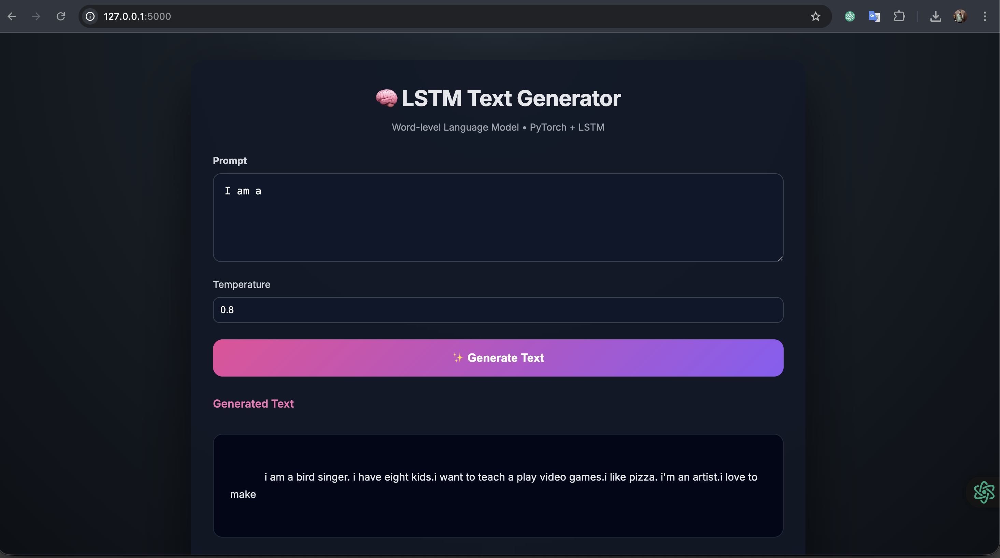

# A2 – LSTM Language Model for Text Generation

**Course:** AT82.05 Artificial Intelligence – Natural Language Understanding (NLU)  
**Assignment:** A2 – Language Model  
**Student:** Anubhav Kharel  
**Instructor:** Chaklam Silpasuwanchai, Todsavad Tangtortan  

---

## Overview

This project implements a **word-level language model using an LSTM** to generate coherent text  
given an input prompt. The model is trained on a text-rich dataset and learns to predict the next  
word based on previous context.

In addition, a **simple web application** is developed to demonstrate real-time text generation  
using the trained model.

---

## Project Structure

├── A2_main.ipynb # Jupyter notebook (training, evaluation, inference)
├── README.md # Project documentation
└── app/
├── app.py # Flask web application
├── saved_lstm_lm/
│ ├── model.pt # Trained LSTM model weights
│ └── vocab.pt # Saved vocabulary (stoi / itos)
└── templates/
└── index.html # Web UI

---

## Task 1 – Dataset Acquisition

### Dataset Used
**The Rizz Corpus** (HuggingFace)

- **Source:** https://huggingface.co/datasets/the-rizz/the-rizz-corpus  
- **Description:**  
  A large text dataset containing informal, conversational English suitable for language modeling.
- **Reason for Selection:**
  - Text-rich and diverse
  - Publicly available
  - Suitable for learning natural language structure and flow

---

## Task 2 – Data Preprocessing

The following preprocessing steps were applied:

1. **Dataset Splitting**
   - Train: 80%
   - Validation: 10%
   - Test: 10%
   - Splits were performed *before* vocabulary construction to avoid data leakage.

2. **Tokenization**
   - Simple whitespace tokenization (`text.split()`).

3. **Vocabulary Construction**
   - Built **only from training data**
   - Tokens with frequency < 3 were removed
   - Special tokens added:
     - `<unk>` for unknown words
     - `<eos>` for sentence termination

4. **Numericalization**
   - Tokens converted to integer indices using `stoi`
   - `<eos>` appended to each sentence

5. **Batch Preparation**
   - Data reshaped to `[batch_size, num_tokens]`
   - Sequential batches created for truncated backpropagation through time (BPTT)

---

## Task 2 – Model Architecture & Training

### Model Architecture

- Embedding Layer  
- 2-layer LSTM  
- Dropout  
- Linear Output Layer  
- Softmax applied during inference  

### Hyperparameters

| Parameter | Value |
|---------|-------|
| Embedding Dimension | 1024 |
| Hidden Dimension | 1024 |
| Number of LSTM Layers | 2 |
| Dropout | 0.65 |
| Batch Size | 128 |
| Sequence Length | 50 |
| Learning Rate | 1e-3 |
| Optimizer | Adam |
| Loss Function | CrossEntropyLoss |

### Training Details

- Gradient clipping applied to prevent exploding gradients  
- ReduceLROnPlateau scheduler used to reduce learning rate when validation loss stops improving  
- Best model saved based on lowest validation loss  
- Performance evaluated using **perplexity**

---

## Task 2 – Evaluation

After training, the best-performing model (based on validation loss) was loaded and evaluated on  
the test set.

- **Metric:** Perplexity  
- Lower perplexity indicates better language modeling performance.

---

## Task 3 – Text Generation (Inference)

During inference:

1. The user provides a text prompt.  
2. The prompt is tokenized and numericalized.  
3. The model predicts the probability distribution of the next word.  
4. A word is sampled and appended to the input.  
5. The process repeats autoregressively.  

### Sampling Strategies Used

- Temperature scaling  
- Top-k sampling  
- Top-p (nucleus) sampling  

These strategies allow control over creativity versus coherence.

---

## Task 3 – Web Application

A simple **Flask web application** is implemented to demonstrate text generation.

### Features

- Text input box for prompt  
- Adjustable controls:
  - Maximum generated tokens
  - Temperature
  - Top-k
  - Top-p
- Displays generated text output

### How the App Works

1. The Flask app loads:
   - `model.pt` (trained LSTM model)
   - `vocab.pt` (saved vocabulary mappings)
2. The user submits a prompt via the web interface.
3. The backend performs inference using the trained model.
4. Generated text is returned and displayed in the browser.

---

## Web Application – Model Interface (Summary)

The web application provides a simple interface for interacting with the trained LSTM-based language  
model. It is built using Flask and allows users to enter a text prompt through a web form. The backend  
loads the trained PyTorch model and the saved vocabulary to ensure that preprocessing during inference  
matches the training setup.

When a user submits a prompt, it is tokenized, converted into numerical indices, and passed to the  
LSTM model for autoregressive text generation. The model predicts the next token step by step, applies  
temperature-based sampling, and generates a coherent continuation of the input text. The generated  
output is converted back to readable text and displayed on the webpage in real time.

---

WEB APP : 

   

